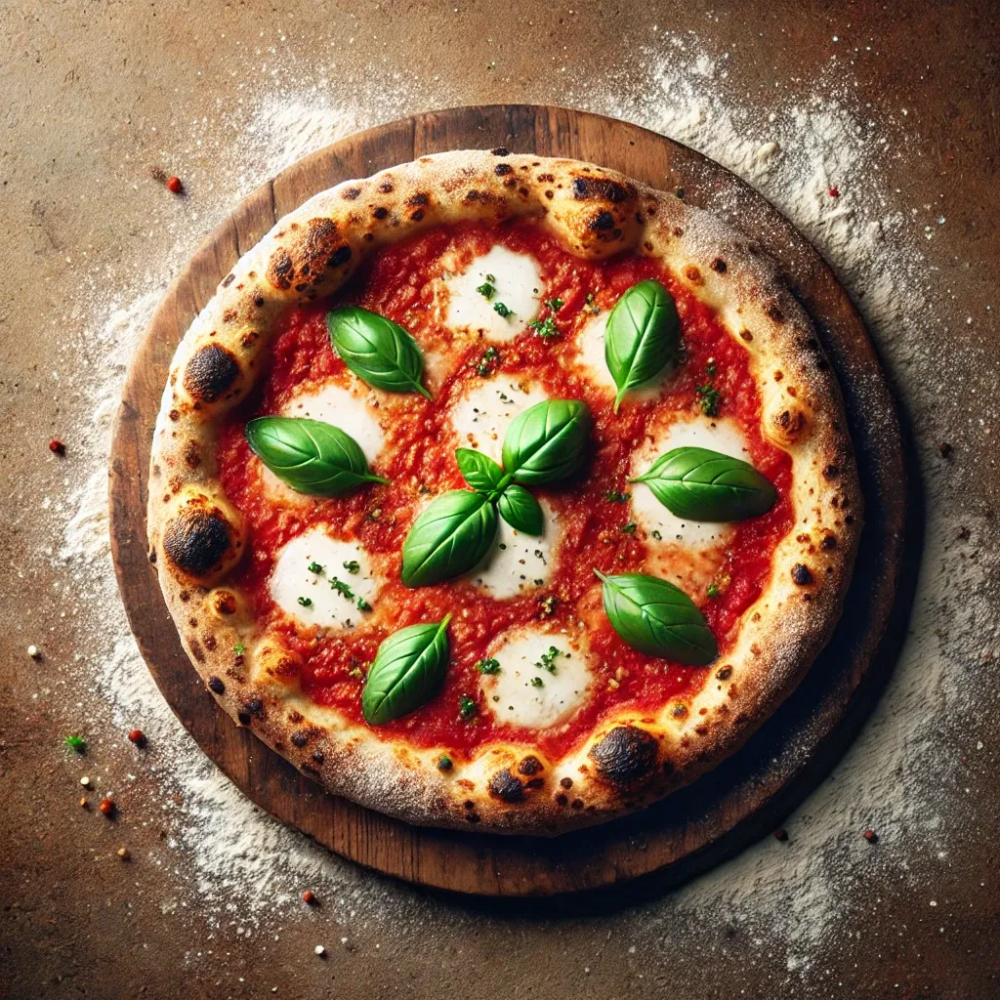

 

# **Pizza Recipe**

## **Ingredients**

**For the dough:**

- 500 grams of flour (preferably Type 00, high-protein pizza flour)
- 325 grams of water (65% hydration, warm, 30-35°C)
- 3 grams of dry yeast (or 9 grams of fresh yeast)
- 20 grams of olive oil
- 10 grams of salt
- 5 grams of sugar

**For the tomato sauce:**

- 300 grams of **Passata tomato sauce** (preferably Mutti brand)
- 10-12 leaves of **fresh basil**
- 1 teaspoon of **sugar**
- 1 teaspoon of **salt**

**For the cheese:**

- 150-200 grams of grated **mozzarella cheese**
- or 200 grams of fresh **mozzarella cheese** (sliced)
- For extra flavor, 50 grams of **goat cheese**

## **Preparation**

1. **Activating the Yeast:**
    1. In a separate bowl, mix 325 grams of warm water (30-35°C) with sugar and yeast until dissolved.
    2. Whisk the mixture well and let it sit for 5 minutes. During this time, the yeast will activate and bubbles will form on the surface.
2. **Preparing the Dough:**
    1. Place the flour in a large mixing bowl.
    2. Add the yeast-water mixture to the flour and start mixing with a spatula or your hand.
    3. Add salt and olive oil, then gather the dough.
    4. Knead the dough for about 8-10 minutes. The dough should be smooth and elastic.
3. **First Rising:**
    1. Place the dough in a bowl, cover it with plastic wrap, and let it rise at room temperature for about 1 hour.
4. **Cold Fermentation (Optional):**
    1. Divide the dough into two equal pieces (each about 400 grams).
    2. Wrap the dough balls in plastic wrap or place them in a closed container and refrigerate for at least 8 hours, preferably 24 hours.
5. **Shaping:**
    1. Remove the dough from the refrigerator and let it come to room temperature for about 1-2 hours.
    2. Lightly flour the countertop and shape the dough into a round (30 cm in diameter).
6. **Second Rising:**
    1. Place the shaped dough on a baking sheet and let it rise at room temperature for 30-60 minutes.
    2. **If short on time:** Preheat the oven to 50°C and then turn it off. Place the dough in the oven for 15-20 minutes to rise in the warm environment.
7. **Preparing the Tomato Sauce:**
    1. Place the passata sauce in a bowl.
    2. Finely chop or add whole fresh basil leaves to the sauce. Optionally, blend all ingredients (basil, sugar, and salt) for a smooth consistency.
    3. The sauce is ready to be spread on the dough.
8. **Adding the Toppings:**
    1. Spread the tomato sauce evenly over the dough.
    2. Add the grated mozzarella cheese or sliced fresh mozzarella. Optionally, sprinkle small pieces of goat cheese on top for extra flavor.
9. **Baking:**
    1. Preheat the oven to its highest temperature (250-300°C). If you have a pizza stone, preheat it in the oven for 30 minutes.
    2. Place the pizza on the stone or baking sheet and bake for 8-10 minutes until the edges are golden and the tomato sauce is slightly caramelized.
10. **Serving:**
    1. Slice the pizza and serve it hot.

## **Notes**

- **Activating the Yeast:** The water temperature should be 30-35°C to activate the yeast. Use a thermometer to check the temperature. If you're in a hurry, you can increase the water temperature to 40-43°C, but be careful not to exceed this as it may kill the yeast.
- **Fermentation Time:** If you're short on time, you can skip the long fermentation process. Allow the dough to rise at room temperature for a total of 2-3 hours.
- **Shaping After Rising:** To save time during the second rising, you can preheat the oven to 50°C, then turn it off and let the dough rise in this warm environment. This accelerates the process.
- **Cheese Selection:**
    - **Fresh mozzarella:** Contains more moisture, which may make the pizza soggy. Blot the cheese with a paper towel to remove excess moisture before using.
    - Grated mozzarella: Convenient and helps achieve a crispy texture.
    - Goat cheese: Adds extra flavor and can be used alongside mozzarella.
